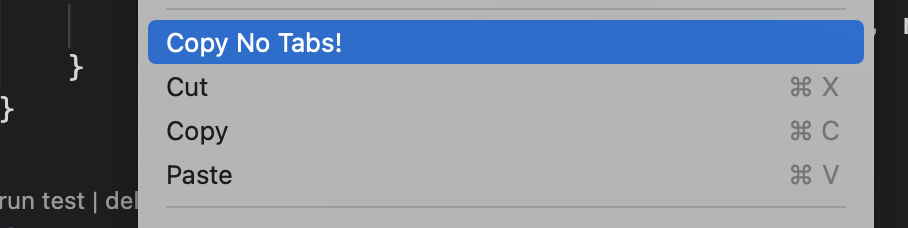

# Copy selected code converting tabs to spaces

Extension name: [amitsaha.copy-no-tab](https://marketplace.visualstudio.com/items?itemName=amitsaha.copy-no-tab).

This Visual Studio Code extension allows you to copy selected text to 
your clipboard, replacing the tabs by spaces. It obtains the size of a
tab from your editor's configuration.

To use, select text and right click, you will see "Copy No Tabs!"
along with the other Cut, Copy and Paste options.

### Credits

- https://medium.com/@rmmmsy/your-first-visual-studio-code-extension-ce8e040ba8ca
- https://github.com/dinhani/vscode-copy-on-select/blob/master/src/extension.ts
